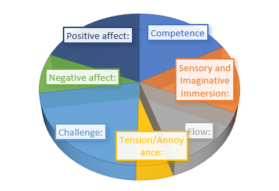

# Information

Contact: ian.peewujian@gmail.com

Done by Pee Wu Jian from August 2019 - October 2019.

# About

This game is a Virtual Reality implementation of the famous 2D Top-Down game Space Invaders (1978). The player plays as a soldier who defends the city from invading alien ships at night.

# Links

Video Link: https://youtu.be/YF8AmyCXVHU

# Gameplay

## Player

The player starts at the rooftop of the main building. He can teleport to the other building's rooftop by pressing the "teleport button". Also, the player can shoot laser beams at enemies using the "attack" button. If the player have no place to stand on, he / she will fall onto the ground and die. 

## Actions

Here we discuss about the actions the player can have in the game.

### Navigation

The player move around the map by teleporting onto rooftops.

### Attack

The player shoots a laser at the crosshair.

### Weapon

The players rifle increases damages the more enemies you kill, so make sure you kill the most enemies before facing the boss!.

## Alien ships

Alien ships spawns at 3 of the spawn points predetermined in the level. There are a total of 3 types of alien ships, each of which will be selected and spawned throughout the gameplay. Their main goal is to destroy all the buildings in the environment.

### Alien Cargo Ship

Tanky alienship that moves towards the building you are currently standing on.

### Alien Fighter

Normal alien ship that moves towards the building at fast speed and shoots projectile at the player periodically.

### Alien Boss

A large alien cargo ship that shoots laser beam at the player.

## Buildings (Environment)

Buildings made up the environment of the level. Only the buildings rooftop are accessible.

### Main Building

Main building, its rooftop is the place that the player start out on. It is more stable and larger in size, therefore it can withstand more blows from alien ships.

### Normal Building
 
Normal building around the main building. It is less stable and is prone to be crushed by the alien ships.

# Player View with respect to Environment

# Features

## Alerts

If there are any bullets close to you, the game will prompt a *red* alert and tell you to move away by teleporting as shown below.

*Alert: "Incoming projectile detected, MOVE!"*

# Screens
          
## Player View

          
## Instructions

          
## Highscore

# Testings & Results
Testings were conducted on the 28th of September, 2019. Results were compiled and shown in the diagram below.

As you can see from the diagram, most of the players felt *Competent, Imaginative,  Challenging,  and have overall great positive effect* from the game.
